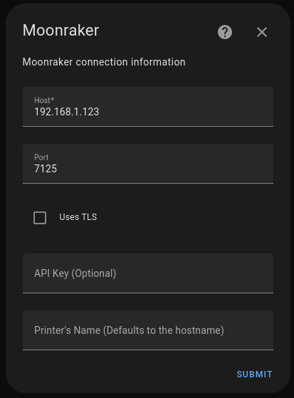

Connection properties
======================

The connection properties dialog can be used to connect to the Moonraker API.
The integration is capable of connecting to most Moonraker deployments.

Connection properties can be defined as follows:

.. list-table:: Connection properties
  :header-rows: 1

  * - name
    - default
    - description
  * - Host
    - None, **(required)**
    - IP address or hostname of Moonraker
  * - Port
    - 7125
    - Moonraker port
  * - Uses TLS
    -
    - use encrypted connections
  * - API Key
    -
    - Moonraker API key
  * - Printer's Name
    - Host address
    - Device name in Home Assistant

Note: Encrypted connections must be configured in Moonraker API or by using a
reverse proxy to connect to Moonraker API.

Polling Rate Configuration
-------------------------------------

It is possible to change the default polling rate value (30 sec) of the integration.

In the integration configuration, you can set the polling rate manually.

*Too small value may overload your Home Assisant setup and your Moonraker setup.*

*This will setting affects the polling frequency whether or not the printer is printing.*

Camera Manual Configuration
-------------------------------------

Camera URL can be manually defined more details in the :ref:`camera_config`
