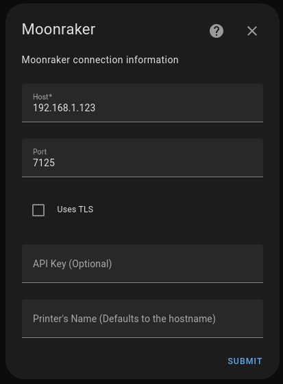

Connection properties
======================

The connection properties dialog can be used to connect to the Moonraker API.
The integration is capable of connecting to most Moonraker deployments.

Connection properties can be defined as follows:

.. list-table:: Connection properties
  :header-rows: 1

  * - name
    - default
    - description
  * - Host
    - None, **(required)**
    - IP address or hostname of Moonraker
  * - Port
    - 7125
    - Moonraker port
  * - Uses TLS
    -
    - use encrypted connections
  * - API Key
    -
    - Moonraker API key
  * - Printer's Name
    - Host address
    - Device name in Home Assistant

Note: Encrypted connections must be configured in Moonraker API or by using a
reverse proxy to connect to Moonraker API.

Polling Rate Configuration
-------------------------------------

It is possible to change the default polling rate value (30 sec) of the integration.

In the integration configuration, you can set the polling rate manually.

*Too small value may overload your Home Assisant setup and your Moonraker setup.*

*This will setting affects the polling frequency whether or not the printer is printing.*

Camera Manual Configuration
-------------------------------------

Camera URL can be manually defined more details in the :ref:`camera_config`

Unreachable Printer
-------------------------------------

If you have your printer turned off by a smart switch or the printer is not reachable, the integration will periodically try to reconnect.
This is not problematic for Home Assistant, but it may create repetitive connection messages in the Home Assistant log file.

In the integration options for the affected printer, enable
``Log unreachable printer connection messages only at DEBUG level``.
When enabled, the integration first checks whether the Moonraker host and port are reachable and avoids starting the websocket client while the endpoint is offline.
This suppresses the normal warning/error noise for intentionally powered-off printers, while DEBUG logging still retains diagnostic information.

Change IP/Hostname of your printer
-------------------------------------

If you want to change the IP/Hostname of your printer, you can do it by either deleting the integration and adding it again or by changing the IP/Hostname in the integration configuration or by manually changing the value in your Home Assistant configuration file.

Go in `whateverConfigFolderYouHave/.storage/core.config_entries` and you should see a JSON entry with the printer IP/Hostname.

.. code-block:: JSON

  {"created_at":"2024-08-10T11:58:41.082494+00:00",
  "data":{"api_key":"","port":"7125","printer_name":"","tls":false,"url":"192.168.x.xx"},
  "disabled_by":null,
  "discovery_keys":{},
  "domain":"moonraker",
  "entry_id":"01J4Y2FDDTP0TKYYJX3RWYG79F",
  "minor_version":1,
  "modified_at":"2024-08-10T11:58:41.093068+00:00",
  "options":{},
  "pref_disable_new_entities":false,
  "pref_disable_polling":false,
  "source":"user",
  "title":"mainsail",
  "unique_id":null,
  "version":1
  },

Change the IP/Hostname in the `url` field and restart Home Assistant.
