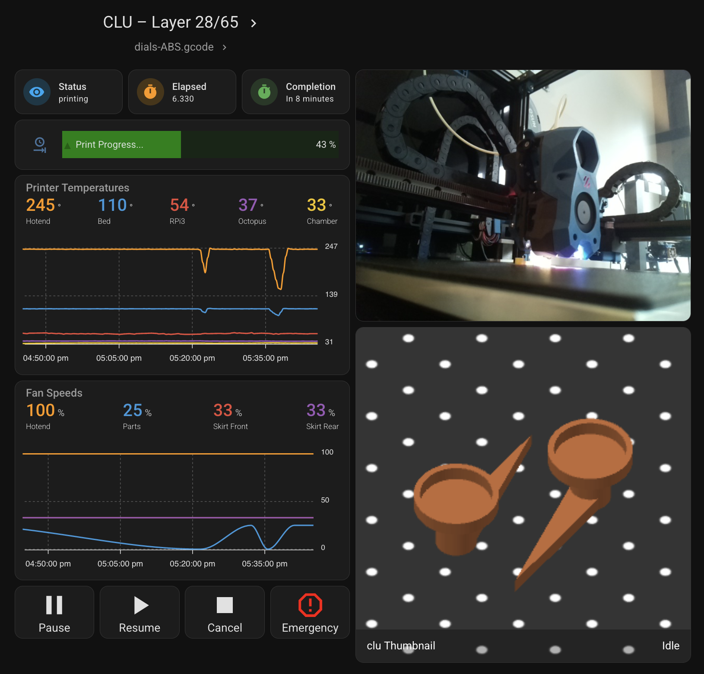

Dashboard
====================================================

As any Home Assistant integration you can add the dashboard of your choice.
Here is some very cool example by `Mike Fischer <https://github.com/greendog99>`__

.. warning::

   this is a dashboard proposed by a community member and all sensors my not be installed.

Here is the yaml code to generate this lovely dashboard.

.. code-block:: yaml

    cards:
      - type: custom:mushroom-title-card
        title: Moonraker – {{ states('sensor.moonraker_current_display_message') }}
        subtitle: "{{ states('sensor.moonraker_filename') }}"
        alignment: center
        title_tap_action: null
        action: url
        url_path: http://crealityv3ke.internal/
      - square: false
        type: grid
        cards:
          - type: tile
            entity: sensor.moonraker_current_print_state
            name: Status
            show_entity_picture: false
            vertical: false
            color: primary
          - type: tile
            entity: sensor.moonraker_print_duration
            name: Elapsed
            color: accent
          - type: tile
            entity: sensor.moonraker_print_eta
            name: Completion
            color: green
            show_entity_picture: false
            vertical: false
        columns: 3
      - type: custom:bar-card
        entity: sensor.moonraker_progress
        name: Print Progress...
        icon: mdi:clock-end
        color: green
        positions:
          indicator: inside
          name: inside
      - square: false
        type: grid
        columns: 4
        cards:
          - type: custom:button-card
            entity: button.moonraker_pause_print
            color_type: icon
            tap_action:
              action: toggle
              name: Pause
          - type: custom:button-card
            entity: button.moonraker_resume_print
            color_type: icon
            tap_action:
              action: toggle
              name: Resume
          - type: custom:button-card
            entity: button.moonraker_cancel_print
            color_type: icon
            tap_action:
              action: toggle
              name: Cancel
            lock:
              enabled: false
            confirmation:
              text: This will CANCEL the print. Are you sure?
          - type: custom:button-card
            entity: button.moonraker_emergency_stop
            color_type: icon
            color: red
            tap_action:
              action: toggle
              name: Emergency
            lock:
              enabled: false
            confirmation:
              text: This will REBOOT the printer. Are you sure?
      - type: custom:apexcharts-card
        graph_span: 1h
        header:
          show: true
          title: Printer Temperatures
          show_states: true
          colorize_states: true
        apex_config:
          chart:
            height: 200px
          legend:
            show: false
          grid:
            xaxis:
              lines:
                show: true
              borderColor: "#555"
            yaxis:
              - opposite: true
                decimals: 0
                apex_config: null
                tickAmount: 2
        all_series_config:
          stroke_width: 2
          float_precision: 0
          show:
            name_in_header: true
        series:
          - entity: sensor.moonraker_extruder_temperature
            name: Hotend
          - entity: sensor.moonraker_bed_temperature
            name: Bed
          - entity: sensor.moonraker_raspberry_pi
            name: RPi3
          - entity: sensor.moonraker_mcu
            name: Octopus
          - entity: sensor.atc_3d_temperature
            name: Chamber
      - type: custom:apexcharts-card
        graph_span: 1h
        header:
          show: true
          title: Fan Speeds
          show_states: true
          colorize_states: true
        apex_config:
          chart:
            height: 200px
          legend:
            show: false
          grid:
            xaxis:
              lines:
                show: true
              borderColor: "#555"
            yaxis:
              - opposite: true
                decimals: 0
                apex_config: null
                tickAmount: 2
        all_series_config:
          stroke_width: 2
          show:
            name_in_header: true
        series:
          - entity: sensor.moonraker_hotend_fan
            name: Hotend
          - entity: sensor.moonraker_fan_speed
            name: Parts
          - entity: sensor.moonraker_controller_fan_front
            name: Skirt Front
          - entity: sensor.moonraker_controller_fan_rear
            name: Skirt Rear
      - type: conditional
        conditions:
          - entity: sensor.moonraker_current_print_state
            state_not: unavailable
        card:
          type: picture-entity
          entity: camera.moonraker_cam
          camera_view: live
          show_name: false
          show_state: false
          aspect_ratio: 4x3
      - type: conditional
        conditions:
          - entity: sensor.moonraker_current_print_state
            state_not: unavailable
        card:
          type: picture-entity
          entity: camera.moonraker_thumbnail
          camera_view: auto
          show_name: false
          show_state: false

