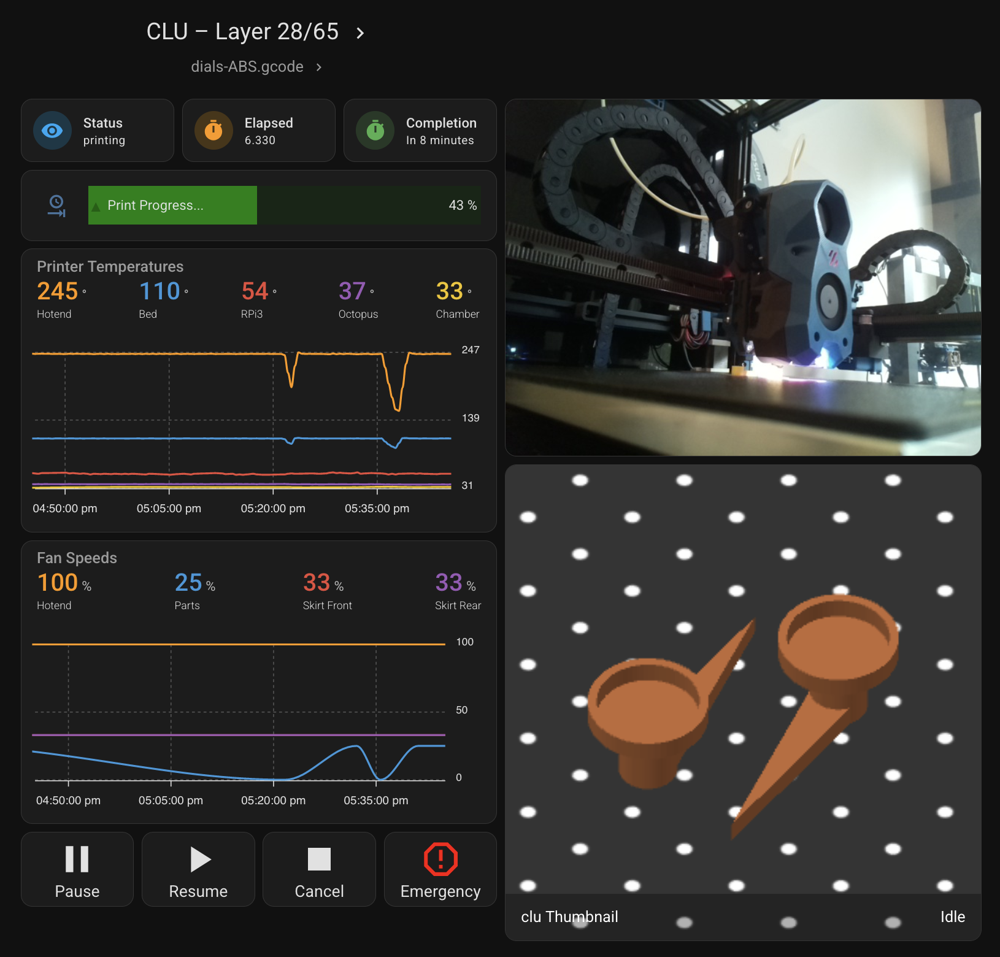

Dashboards
====================================================

As any Home Assistant integration you can add the dashboard of your choice.

Mike Fischer Dashboard
----------------------------

Here is some very cool example by `Mike Fischer <https://github.com/greendog99>`__

.. warning::

   this is a dashboard proposed by a community member and all sensors my not be installed.

Here is the yaml code to generate this lovely dashboard.

.. collapse:: Code

  .. code-block:: yaml

      cards:
        - type: custom:mushroom-title-card
          title: Moonraker – {{ states('sensor.moonraker_current_display_message') }}
          subtitle: "{{ states('sensor.moonraker_filename') }}"
          alignment: center
          title_tap_action:
            action: url
            url_path: http://moonraker.local/
        - square: false
          type: grid
          cards:
            - type: tile
              entity: sensor.moonraker_current_print_state
              name: Status
              show_entity_picture: false
              vertical: false
              color: primary
            - type: tile
              entity: sensor.moonraker_print_duration
              name: Elapsed
              color: accent
            - type: tile
              entity: sensor.moonraker_print_eta
              name: Completion
              color: green
              show_entity_picture: false
              vertical: false
          columns: 3
        - type: custom:bar-card
          entity: sensor.moonraker_progress
          name: Print Progress...
          icon: mdi:clock-end
          color: green
          positions:
            indicator: inside
            name: inside
        - square: false
          type: grid
          columns: 4
          cards:
            - type: custom:button-card
              entity: button.moonraker_pause_print
              color_type: icon
              tap_action:
                action: toggle
                name: Pause
            - type: custom:button-card
              entity: button.moonraker_resume_print
              color_type: icon
              tap_action:
                action: toggle
                name: Resume
            - type: custom:button-card
              entity: button.moonraker_cancel_print
              color_type: icon
              tap_action:
                action: toggle
                name: Cancel
              lock:
                enabled: false
              confirmation:
                text: This will CANCEL the print. Are you sure?
            - type: custom:button-card
              entity: button.moonraker_emergency_stop
              color_type: icon
              color: red
              tap_action:
                action: toggle
                name: Emergency
              lock:
                enabled: false
              confirmation:
                text: This will REBOOT the printer. Are you sure?
        - type: custom:apexcharts-card
          graph_span: 1h
          header:
            show: true
            title: Printer Temperatures
            show_states: true
            colorize_states: true
          apex_config:
            chart:
              height: 200px
            legend:
              show: false
            grid:
              xaxis:
                lines:
                  show: true
                borderColor: "#555"
              yaxis:
                - opposite: true
                  decimals: 0
                  tickAmount: 2
          all_series_config:
            stroke_width: 2
            float_precision: 0
            show:
              name_in_header: true
          series:
            - entity: sensor.moonraker_extruder_temperature
              name: Hotend
            - entity: sensor.moonraker_bed_temperature
              name: Bed
            - entity: sensor.moonraker_raspberry_pi
              name: RPi3
            - entity: sensor.moonraker_mcu
              name: Octopus
            - entity: sensor.atc_3d_temperature
              name: Chamber
        - type: custom:apexcharts-card
          graph_span: 1h
          header:
            show: true
            title: Fan Speeds
            show_states: true
            colorize_states: true
          apex_config:
            chart:
              height: 200px
            legend:
              show: false
            grid:
              xaxis:
                lines:
                  show: true
                borderColor: "#555"
              yaxis:
                - opposite: true
                  decimals: 0
                  tickAmount: 2
          all_series_config:
            stroke_width: 2
            show:
              name_in_header: true
          series:
            - entity: sensor.moonraker_hotend_fan
              name: Hotend
            - entity: sensor.moonraker_fan_speed
              name: Parts
            - entity: sensor.moonraker_controller_fan_front
              name: Skirt Front
            - entity: sensor.moonraker_controller_fan_rear
              name: Skirt Rear
        - type: conditional
          conditions:
            - entity: sensor.moonraker_current_print_state
              state_not: unavailable
          card:
            type: picture-entity
            entity: camera.moonraker_cam
            camera_view: live
            show_name: false
            show_state: false
            aspect_ratio: 4x3
        - type: conditional
          conditions:
            - entity: sensor.moonraker_current_print_state
              state_not: unavailable
          card:
            type: picture-entity
            entity: camera.moonraker_thumbnail
            camera_view: auto
            show_name: false
            show_state: false

BeHappy2021 Dashboard
----------------------------

Here is another example by `BeHappy2021 <https://github.com/BeHappy2021>`__

This dashboard that uses `sensor.printer_current_print_state` to decide what to display.

.. warning::

   this is a dashboard need to install custom front end add-on

Install process: You need to create the input_text helpers for job filament, total filament and total jobs. They get set by the automation. This dashboard uses the new sections feature so you can arrange the cards by drag and drop after creating them.
Remember to change all the entity names to match yours - search for 3dprinter and replace all with your printer name.

Uses the following custom cards installed through HACS:

- `apexcharts-card <https://github.com/RomRider/apexcharts-card>`__
- `state-switch <https://github.com/thomasloven/lovelace-state-switch>`__
- `mushroom-entity-card, mushroom-template-card <https://github.com/piitaya/lovelace-mushroom>`__
- `bar-card <https://github.com/custom-cards/bar-card>`__

When printer is off.

When printer is standby.

When there is a print in Progress.

When print is completed.

Here is the yaml code to generate this lovely dashboard.

.. collapse:: Code

  .. code-block:: yaml

      icon: mdi:printer-3d
      type: sections
      sections:
      icon: mdi:printer-3d
      type: sections
      sections:
        - type: grid
          cards:
            - type: custom:state-switch
              entity: sensor.3dprinter_current_print_state
              transition: flip-x
              states:
                unavailable:
                  type: vertical-stack
                  cards:
                    - type: custom:mushroom-entity-card
                      entity: input_text.job_filament
                      name: Filament used in last job
                      layout: vertical
                      tap_action:
                        action: none
                      hold_action:
                        action: none
                      double_tap_action:
                        action: none
                    - type: custom:mushroom-entity-card
                      entity: input_text.total_filament
                      name: Total Filament Used
                      layout: vertical
                      tap_action:
                        action: none
                      hold_action:
                        action: none
                      double_tap_action:
                        action: none
                    - type: custom:mushroom-entity-card
                      entity: input_text.total_jobs
                      name: Total Jobs
                      layout: vertical
                      tap_action:
                        action: none
                      hold_action:
                        action: none
                      double_tap_action:
                        action: none
                    - type: custom:mushroom-entity-card
                      entity: input_text.total_time
                      name: Total Time
                      layout: vertical
                      tap_action:
                        action: none
                      hold_action:
                        action: none
                      double_tap_action:
                        action: none
                standby:
                  type: custom:mushroom-template-card
                  primary: Printer is standing by
                  layout: vertical
                  tap_action:
                    action: url
                    url_path: http://moonraker_url #This will only work over LAN you need e.g Letsencrypt for access via internet
                  hold_action:
                    action: none
                  double_tap_action:
                    action: none
                  icon_color: yellow
                  icon: mdi:printer-3d
                printing:
                  type: vertical-stack
                  cards:
                    - type: custom:mushroom-template-card
                      secondary: >-
                        Current filename - {{
                        states('sensor.3dprinter_filename') }}
                      fill_containter: true
                      multiline_secondary: true
                      layout: vertical
                      tap_action:
                        action: url
                        url_path: http://moonraker_url
                      hold_action:
                        action: none
                      double_tap_action:
                        action: none
                      icon_color: green
                      icon: mdi:printer-3d
                    - type: horizontal-stack
                      cards:
                        - type: custom:mushroom-entity-card
                          entity: sensor.3dprinter_current_print_state
                          name: Status
                          layout: vertical
                          tap_action:
                            action: none
                          hold_action:
                            action: none
                          double_tap_action:
                            action: none
                        - type: custom:mushroom-entity-card
                          entity: sensor.3dprinter_print_duration
                          name: Elapsed
                          layout: vertical
                          tap_action:
                            action: none
                          hold_action:
                            action: none
                          double_tap_action:
                            action: none
                        - type: custom:mushroom-entity-card
                          entity: sensor.3dprinter_print_eta
                          name: Completion
                          layout: vertical
                          tap_action:
                            action: none
                          hold_action:
                            action: none
                          double_tap_action:
                            action: none
                        - type: custom:mushroom-entity-card
                          entity: binary_sensor.3dprinter_filament_sensor
                          name: Filament
                          layout: vertical
                          tap_action:
                            action: none
                          hold_action:
                            action: none
                          double_tap_action:
                            action: none
                complete:
                  type: custom:mushroom-template-card
                  Primary: Printing has finished
                  layout: vertical
                  fill_containter: true
                  tap_action:
                    action: url
                    url_path: http://moonraker_url
                  hold_action:
                    action: none
                  double_tap_action:
                    action: none
                  icon_color: green
                  icon: mdi:printer-3d
            - type: custom:state-switch
              entity: sensor.3dprinter_current_print_state
              transition: flip-x
              states:
                printing:
                  type: vertical-stack
                  cards:
                    - type: custom:bar-card
                      name: Print progress..
                      icon: mdi:clock-end
                      color: blue
                      entity: sensor.3dprinter_progress
                    - type: custom:bar-card
                      name: Fan speed
                      icon: mdi:fan
                      color: blue
                      entity: sensor.3dprinter_nozzle_fan
                    - type: tile
                      name: Filament used
                      tap_action:
                        action: none
                      icon_tap_action:
                        action: none
                      entity: sensor.3dprinter_filament_used
                    - type: picture-entity
                      show_state: false
                      show_name: false
                      camera_view: auto
                      name: Thumbnail
                      tap_action:
                        action: none
                      icon_tap_action:
                        action: none
                      entity: camera.3dprinter_thumbnail
                complete:
                  type: vertical-stack
                  cards:
                    - type: custom:bar-card
                      name: Print progress..
                      icon: mdi:clock-end
                      color: blue
                      entity: sensor.3dprinter_current_print_state
                    - type: tile
                      name: Filament used
                      tap_action:
                        action: none
                      icon_tap_action:
                        action: none
                      entity: input_text.job_filament
                standby:
                  type: vertical-stack
                  cards:
                    - type: custom:mushroom-template-card
                      primary: Job progress will appear here
                      layout: vertical
                      tap_action:
                        action: url
                        url_path: http://moonraker_url
                      hold_action:
                        action: none
                      double_tap_action:
                        action: none
                      icon_color: yellow
                      icon: mdi:printer-3d
                    - type: tile
                      name: Filament used in last job
                      vertical: true
                      tap_action:
                        action: none
                      icon_tap_action:
                        action: none
                      entity: input_text.job_filament
          title: 3D Printer
        - type: grid
          cards:
            - type: custom:state-switch
              entity: sensor.3dprinter_current_print_state
              transition: flip-x
              states:
                unavailable:
                  type: custom:mushroom-template-card
                  primary: Printer turned off
                  layout: vertical
                  tap_action:
                    action: none
                  hold_action:
                    action: none
                  double_tap_action:
                    action: none
                  icon_color: red
                  icon: mdi:printer-3d
                printing:
                  type: horizontal-stack
                  cards:
                    - type: custom:button-card
                      name: Pause
                      tap_action:
                        action: toggle
                      entity: button.3dprinter_pause_print
                    - type: custom:button-card
                      name: Resume
                      tap_action:
                        action: toggle
                      entity: button.3dprinter_resume_print
                    - type: custom:button-card
                      name: Cancel
                      tap_action:
                        action: toggle
                      entity: button.3dprinter_cancel_print
                    - type: custom:button-card
                      name: Emergency
                      tap_action:
                        action: toggle
                      color: red
                      confirmation:
                        text: This will REBOOT the printer. Are you sure?
                      entity: button.3dprinter_emergency_stop
                standby:
                  type: custom:mushroom-template-card
                  primary: Controls will appear here
                  layout: vertical
                  tap_action:
                    action: url
                    url_path: http://moonraker_url
                  hold_action:
                    action: none
                  double_tap_action:
                    action: none
                  icon_color: yellow
                  icon: mdi:printer-3d
            - square: true
              type: grid
              cards:
                - type: conditional
                  conditions:
                    - condition: state
                      entity: sensor.3dprinter_current_print_state
                      state: printing
                  card:
                    type: custom:apexcharts-card
                    graph_span: 1h
                    span:
                      start: hour
                      offset: "-10min"
                    header:
                      show: true
                      title: Temperatures
                      show_states: true
                      colorize_states: true
                    now:
                      show: true
                      label: Now
                      color: "#00ff00"
                    all_series_config:
                      show:
                        legend_value: false
                      float_precision: 0
                    apex_config:
                      legend:
                        show: false
                    series:
                      - entity: sensor.3dprinter_extruder_temperature
                        name: Nozzle
                        opacity: 0.4
                      - entity: sensor.3dprinter_extruder_target
                        name: Nozzle target
                        opacity: 0.4
                      - entity: sensor.3dprinter_bed_temperature
                        name: Bed
                        opacity: 0.4
                      - entity: sensor.3dprinter_bed_target
                        name: Bed target
                        opacity: 0.4
                      - entity: sensor.3dprinter_mcu_temp
                        name: MCU
                        opacity: 0.4
                - type: conditional
                  conditions:
                    - condition: state
                      entity: sensor.3dprinter_current_print_state
                      state: standby
                  card:
                    type: custom:mushroom-template-card
                    primary: Temperatures will appear here
                    layout: vertical
                    tap_action:
                      action: url
                      url_path: http://moonraker_url
                    hold_action:
                      action: none
                    double_tap_action:
                      action: none
                    icon_color: yellow
                    icon: mdi:printer-3d
              columns: 1
          title: " "
      cards: []

.. collapse:: Automation to set input_text values

  .. code-block:: yaml

      alias: Set printer variables on start up.
      description: ""
      trigger:
        - platform: state
          entity_id:
            - sensor.3dprinter_printer_state
          to: ready
          for:
            hours: 0
            minutes: 1
            seconds: 0
          from: null
        - platform: state
          entity_id:
            - sensor.3dprinter_current_print_state
          from: printing
          for:
            hours: 0
            minutes: 1
            seconds: 0
      condition: []
      action:
        - service: input_text.set_value
          data:
            value: >-
              {{
              states.sensor.3dprinter_totals_filament_used.state_with_unit
              }}
          target:
            entity_id: input_text.total_filament
        - service: input_text.set_value
          data:
            value: "{{ states.sensor.3dprinter_totals_jobs.state_with_unit }}"
          target:
            entity_id: input_text.total_jobs
        - service: input_text.set_value
          data:
            value: >-
              {{ states.sensor.3dprinter_totals_print_time.state_with_unit
              }}
          target:
            entity_id: input_text.total_time

.. collapse:: Automation for when printing is finished - also sends a notification via the mobile app. I've set it to be 98% completion as sometimes it doesn't fire at 99 or 100% if it is a quick print.

  .. code-block:: yaml

    alias: Printer finished
    description: ""
    trigger:
      - platform: state
        entity_id:
          - sensor.3dprinter_progress
        to: "98"
    condition: []
    action:
      - service: input_text.set_value
        data:
          value: "{{ states.sensor.3dprinter_filament_used.state_with_unit }}"
        target:
          entity_id: input_text.job_filament
      - service: notify.mobile_app
        data:
          message: TTS
          title: Printing complete
          data:
            tts_text: Print job is complete
      - service: notify.mobile_app
        data:
          title: 🖨 Printer finished
          message: Printer job has finished
          data: {}
    mode: single

.. collapse:: Optional automation to reload the automation when you turn on the printer or it finishes printing:

  .. code-block:: yaml

      alias: Reload Printer data
      description: ""
      trigger:
        - platform: state
          entity_id:
            - sensor.3dprinter_printer_state
          from: unavailable
        - platform: state
          entity_id:
            - sensor.3dprinter_current_print_state
          from: printing
      condition: []
      action:
        - service: homeassistant.reload_config_entry
          data: {}
          target:
            device_id: #whatever your printer device_id is

Spoolman active spool (Mushroom card)
-------------------------------------

.. image:: _static/spoolmanMushroomCard.png
    :align: center

If you use Spoolman, the integration exposes a **Spool ID** sensor (active spool id).
You can combine it with the Home Assistant Spoolman integration to display the active filament name and a colored circle using a Mushroom template card.

This example uses:

- ``sensor.<printer>_spool_id`` (from this integration)
- ``sensor.spoolman_spool_<id>`` (from the Home Assistant Spoolman integration)

Replace entity ids below with your own.

1) Template Sensor helper (UI)
^^^^^^^^^^^^^^^^^^^^^^^^^^^^^^

Create a **Template Sensor** helper in Home Assistant.

- **State template** (shows friendly filament name)
- Add an attribute called ``color`` (hex color for the dot)

.. collapse:: Template Sensor helper (State + Availability)

  .. rubric:: State template

  .. code-block:: jinja

        
        
          No active spool
        
          
          {{ state_attr(eid, 'friendly_name') or ('Spool ' ~ sid) }}
        

  .. rubric:: Availability template

  .. code-block:: jinja

        
        
        
          false
        
          
          {{ states(eid) not in ['unknown','unavailable'] }}
        

.. collapse:: Attribute template (key: color)

  .. code-block:: jinja

      
      
        {{ none }}
      
        
        
        {{ ('#' ~ h) if h else none }}
      

2) Mushroom template card
^^^^^^^^^^^^^^^^^^^^^^^^^

.. collapse:: Code

  .. code-block:: yaml

      type: custom:mushroom-template-card
      entity: sensor.active_spool
      primary: "{{ states('sensor.active_spool') }}"
      secondary: Active spool
      icon: mdi:circle
      icon_color: "{{ state_attr('sensor.active_spool', 'color') or '#999999' }}"
      tap_action:
        action: more-info
